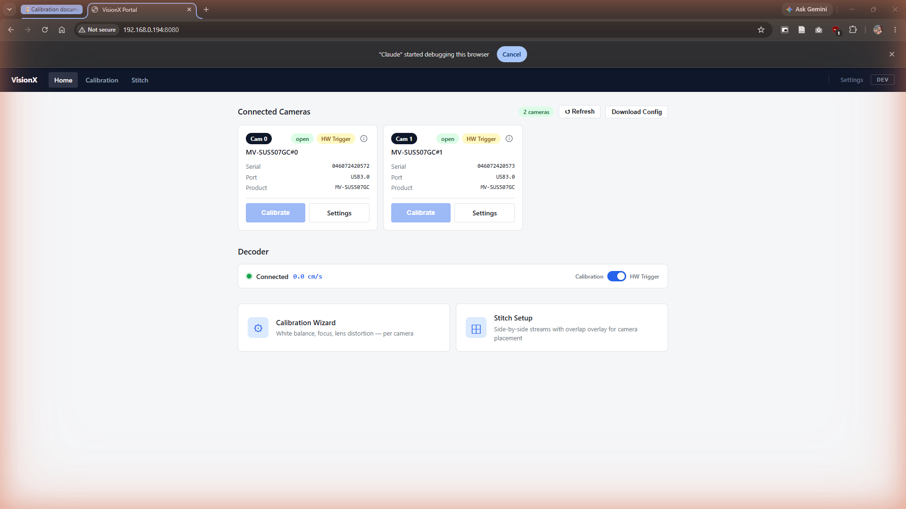
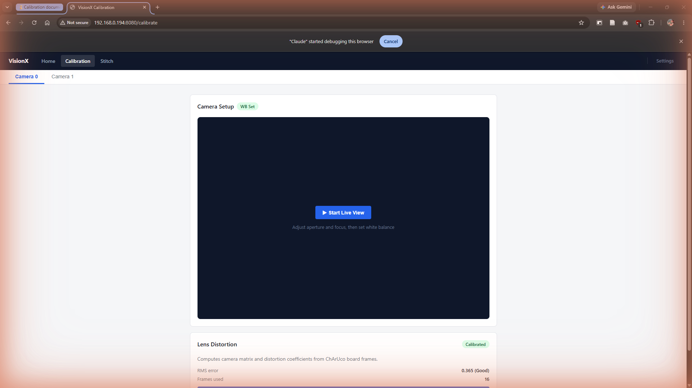
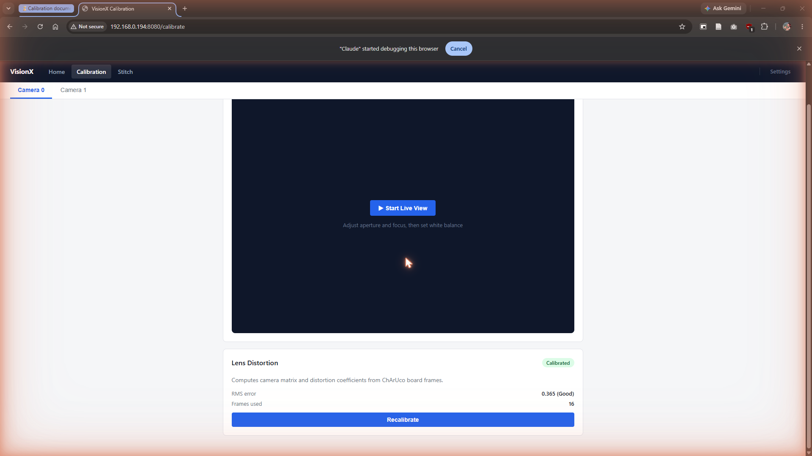
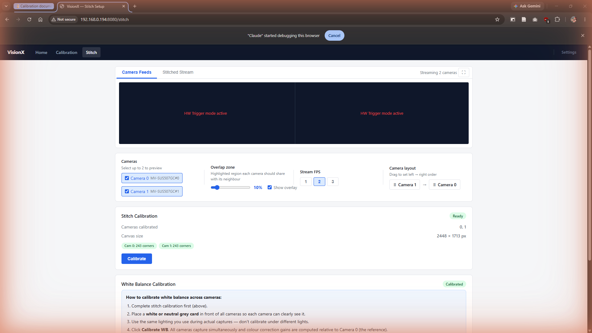
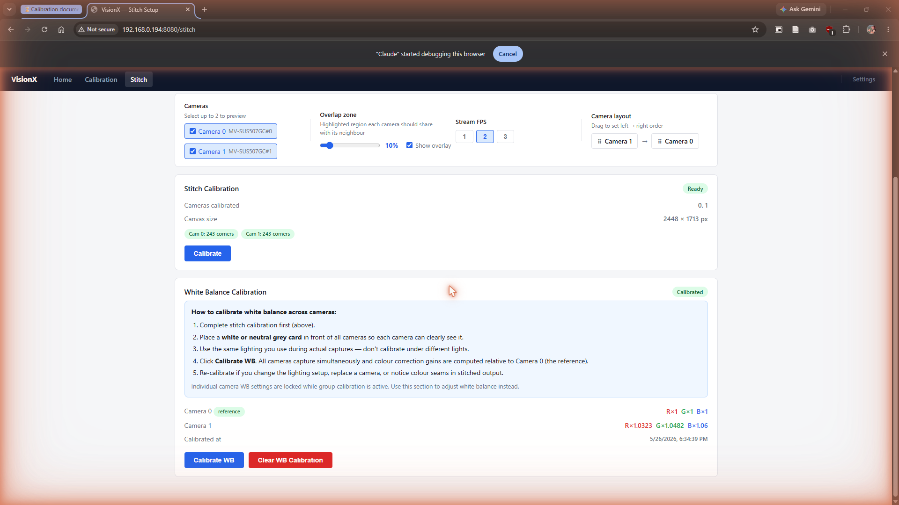

# Camera Calibration Guide

This guide walks through the full calibration sequence for the fabric station's dual-camera system. Calibration should be performed whenever cameras are repositioned, replaced, or after significant lighting changes.

---

## Prerequisites

### 1. Load the Garment Roll

Before doing anything else, load the garment roll into the inspection machine and make sure it is seated in its normal running position.

**Why this matters:**
The cameras are mounted above the roll, not above a flat table. The top surface of the roll sits higher than the floor. If you calibrate with the roll removed — or place the calibration sheet flat on the table instead of on top of the roll — the stitch calibration will be wrong. When the machine runs with a real roll loaded, the height difference will cause the stitched image to be misaligned at the join between cameras, especially at the edges.

**What to do:**

1. Load the garment roll into the machine as normal.
2. Place the calibration sheet flat on top of the roll surface — not on the table or floor.
3. Make sure the sheet lies flat with no wrinkles or folds.

> The calibration sheet must always be placed on the roll surface, at the same height the fabric sits during normal inspection.

---

### 2. Disable HW Trigger Mode


By default, both cameras run in **Hardware Trigger mode** (controlled by the decoder). In this mode the cameras only capture frames when the decoder sends a trigger signal, so the live stream and calibration tools will not work.

**Before starting any calibration, disable HW Trigger:**

1. Open the VisionX portal home page.
2. In the **Decoder** section, toggle the **HW Trigger** switch to OFF.
3. Confirm both camera cards no longer show the yellow `HW Trigger` badge.



> **Note:** Remember to re-enable HW Trigger after calibration is complete so the system returns to normal capture mode.

### 3. Print Calibration Targets

You will need two printed targets:

| Target            | Purpose                              | File                                                                  |
| ----------------- | ------------------------------------ | --------------------------------------------------------------------- |
| **Siemens star**  | Focus tuning                         | Generate with `scripts/gen_siemens_star.py`                           |
| **ChArUco board** | Lens distortion + stitch calibration | [`targets/charuco_20x14_10mm_checker_8mm_marker_DICT_4X4_250_40px.png`](../../targets/charuco_20x14_10mm_checker_8mm_marker_DICT_4X4_250_40px.png) |
| **Siemens star**  | Focus tuning | [`targets/siemens_star_letter.png`](../../targets/siemens_star_letter.png) |

Print both at **100% scale** (no "fit to page"). Place them flat and perpendicular to the cameras.

---

## Step 1: Per-Camera Setup (Focus & White Balance)

Repeat this step for each camera (Camera 0, Camera 1).

1. Navigate to **Calibration** in the top navigation bar.
2. Select the camera tab (e.g. **Camera 0**).



### 1a. Start Live View

Click **Start Live View** to open the calibration stream. This shows:

- **Magenta pixels** — focus peaking (high edge contrast areas)
- **Yellow ROI box** — center region used for sharpness scoring
- **Sharpness score & trend** (top-left) — Laplacian variance with "increasing / stable / decreasing" feedback
- **Sharpness bar** (bottom) — normalized to session peak

### 1b. Adjust Focus

1. Place the printed **Siemens star** in front of the camera at working distance (~50 cm for most lenses).
2. Physically turn the lens focus ring while watching the sharpness score and green bar.
3. Stop when the score peaks and the trend shows **"at or near peak"** (● symbol).
4. Lock the focus ring with the locking screw.

> Typical `lens_position` values: `0.0` = infinity, `2.0` ≈ 50 cm, `4.0` ≈ 25 cm, `8.0` ≈ 12 cm.

### 1c. Set White Balance

1. Place a **white or neutral grey card** in front of the camera under the working lights.
2. Click **Set WB** (or the white balance button in the Camera Setup panel).
3. Verify the `WB Set` badge appears green next to "Camera Setup".
4. Re-check if lighting conditions change.

Repeat Steps 1a–1c for all cameras before continuing.

---

## Step 2: Lens Distortion Calibration

This step fits the camera matrix (K) and distortion coefficients (D) from a ChArUco board. It is required for wide-angle lenses or when high geometric accuracy is needed.



The **Lens Distortion** card shows the current status:

- **Calibrated** (green) — calibration is stored, RMS and frames shown
- **Not calibrated** (red) — needs to be run

### 2a. Collect Frames

1. Click **Recalibrate** (or **Calibrate** if uncalibrated) to open the collection wizard.
2. Hold the printed **ChArUco board** in front of the camera.
3. Click **Collect Frame** for each position — vary the angle (tilt, rotate) and distance across the working area.
4. The guide overlay shows a green box; keep the board inside it per frame.
5. Aim for **15–20 accepted frames**. The progress bar tracks this.
   - A frame is accepted if ≥ 6 ChArUco corners are detected.
   - Click **Undo Last** to remove a bad frame.
6. When the counter reaches the target, click **Compute**.

### 2b. Evaluate Results

| RMS error | Quality                                  |
| --------- | ---------------------------------------- |
| < 0.5     | Good                                     |
| 0.5 – 1.0 | Acceptable                               |
| > 1.0     | Poor — recollect with more varied angles |

A good result is stored in `data/lens_calibration.json` and applied automatically on every subsequent capture.

Repeat for Camera 1 by switching the camera tab.

---

## Step 3: Stitch Calibration

Stitch calibration computes a homography for each camera that maps it onto a shared flat canvas. It uses the same ChArUco board placed in the overlap zone between cameras.

1. Navigate to **Stitch** in the top navigation bar.



The **Camera Feeds** panel shows side-by-side live streams. Adjust:

- **Overlap zone** slider — how much of each camera edge is highlighted (helps with board placement).
- **Camera layout** drag handles — set left-to-right order to match physical camera positions.

### 3a. Run Stitch Calibration

1. Place the ChArUco board in the **overlap zone** so both Camera 0 and Camera 1 can see it simultaneously.
2. In the **Stitch Calibration** section, click **Calibrate**.
3. The system grabs one frame from each camera and detects corners.

**Expected result:**

- Status badge turns **Ready** (green).
- Both `Cam 0: N corners` and `Cam 1: N corners` chips show ≥ 8 corners each.
- Canvas size (e.g. `2448 × 1713 px`) is displayed.

**If a camera shows 0 corners:**

- Reposition the board so it is fully visible and well-lit.
- Increase overlap zone percentage.
- Check that lens distortion calibration was completed first.

**3-camera setup (non-overlapping outer cameras):**
Run calibration in two passes — first for cameras 0 and 1, then for cameras 1 and 2 — so the chain connects through the middle camera.

---

## Step 4: White Balance Calibration (Multi-Camera)

This step ensures consistent colour across all cameras by computing per-camera correction gains relative to Camera 0 (the reference).



**Run after stitch calibration is complete.**

1. Place a **white or neutral grey card** in front of all cameras simultaneously under working lights.
2. In the **White Balance Calibration** section, click **Calibrate WB**.
3. All cameras capture at once; correction multipliers for R, G, B channels are stored.

**Verify:** Camera 1 gains should be close to `R×1`, `G×1`, `B×1`. Large deviations (> 0.2 from 1.0) may indicate lighting inconsistency.

> Individual per-camera WB (from Step 1c) is locked while group WB calibration is active. This section replaces it for stitched output.

To revert, click **Clear WB Calibration**.

---

## Calibration Order Summary

```
1. Disable HW Trigger (Home page)
2. For each camera:
   a. Adjust focus (Calibration → Camera tab → Start Live View)
   b. Set white balance (grey card, same lighting as production)
3. For each camera:
   Collect lens distortion frames → Compute (Calibration → Lens Distortion)
4. Place ChArUco board in overlap zone → Calibrate (Stitch → Stitch Calibration)
5. Place grey card in front of all cameras → Calibrate WB (Stitch → White Balance Calibration)
6. Re-enable HW Trigger (Home page)
```

---

## Troubleshooting

| Symptom                                          | Likely cause                             | Fix                                                 |
| ------------------------------------------------ | ---------------------------------------- | --------------------------------------------------- |
| Live view shows black / "HW Trigger mode active" | HW Trigger is ON                         | Disable HW Trigger on Home page                     |
| Lens distortion RMS > 1.0                        | Not enough frame variety                 | Recollect — tilt and rotate board more aggressively |
| Stitch calibration: 0 corners detected           | Board not visible to camera              | Move board into camera's field of view; check focus |
| Colour seam visible in stitched output           | WB calibration missing or stale          | Re-run Step 4 under current lighting                |
| Cameras show different exposure                  | Per-camera gain/exposure settings differ | Check Settings per camera; set identical exposure   |
